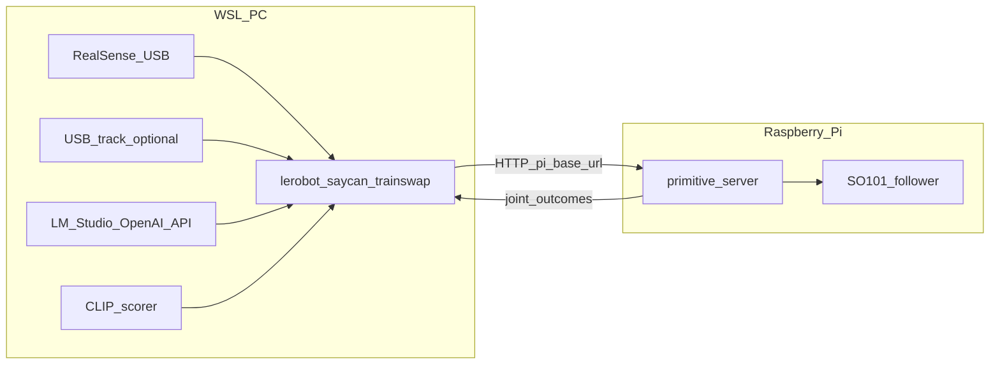

# Runbook: SO-101 trainswap（WSL 知覚 + Pi 制御）

**目的**: 手元 PC の **WSL** で RealSense・（任意）USB 俯瞰・CLIP・LLM を回し、**Raspberry Pi** 上の `lerobot-so101-primitive-server` 経由で SO-101 を動かす。

**成果物の置き場**: リポジトリ内の [experiments/so101_trainswap/artifacts/](../../experiments/so101_trainswap/artifacts/)（Git 対象外）。姿勢・キャリブ JSON はここに集約する。

## アーキテクチャ



- **`--pi_base_url`**: WSL から見た `http://<PiのIP>:8765`（実装は `/primitive` を結合）。
- **`--realsense_serial`**: WSL 上で認識される RealSense のシリアル（または名前）。

## 事前チェック（どちらのマシンでも）

- [ ] 同一リポジトリを WSL と Pi の両方に clone し、`git pull` でコミットを揃えた。
- [ ] LeRobot ルートで WSL は `uv sync --extra saycan`、Pi は少なくとも `uv sync --extra feetech` を実行済み。
- [ ] [env/wsl.env.example](../../experiments/so101_trainswap/env/wsl.env.example) を `env/wsl.env` にコピーし、IP・シリアル等を埋めた（Pi 用は [env/pi.env.example](../../experiments/so101_trainswap/env/pi.env.example) 参照）。

---

## Phase 0: SO-101 を Pi で単体確認

| 項目 | 内容 |
|------|------|
| **実行** | Pi |
| **目的** | follower が安定して動くこと（テレオペ・キャリブ・安全姿勢）。 |
| **入力** | USB 接続の SO-101、`lerobot-find-port` 等でポート確認。 |
| **出力** | 再現できる `home` など安全姿勢の合意。 |
| **失敗時** | ポート権限（`dialout`）、電源・ケーブル、`lerobot-calibrate` の再実行。 |

CLI の例はプロジェクトの `note.md` や LeRobot 公式ドキュメントを参照。本 Runbook では **Phase 1 以降の trainswap 統合**にフォーカスする。

---

## Phase 1: 姿勢ライブラリ（主に Pi）

| 項目 | 内容 |
|------|------|
| **実行** | Pi（`so101_poses.json` を編集するマシン） |
| **目的** | 名前付き関節姿勢を JSON に保存する。 |
| **入力** | アームを各姿勢へ手動移動。 |
| **出力** | `experiments/so101_trainswap/artifacts/so101_poses.json` |
| **失敗時** | `--robot.port` の取り違え、`--out_path` のディレクトリ存在確認。 |

必須に近いキー（デフォルトの `pose_names`）: `home`, `pre_pick`, `pick`, `lift`, `pre_place`, `place`, `post_place`。電源ボタン系を使う場合は `power_pre`, `power_press`。

```bash
cd /path/to/lerobot
uv run lerobot-so101-save-pose \
  --robot.type=so101_follower \
  --robot.port=/dev/ttyACM1 \
  --robot.id=my_follower \
  --pose_name=home \
  --out_path=experiments/so101_trainswap/artifacts/so101_poses.json
```

他の `pose_name` でも同様に追記する。

### WSL に同じ JSON が必要な場合

キャリブ（Phase 2）と SayCan（Phase 3）は **同じ `so101_poses.json` パス**を参照する。

```bash
# 例: Pi から WSL 側の開発マシンへ（ユーザー名・IP は環境に合わせる）
scp experiments/so101_trainswap/artifacts/so101_poses.json user@wsl-host:/path/to/lerobot/experiments/so101_trainswap/artifacts/
```

逆方向（WSL で編集した JSON を Pi の primitive サーバへ）:

```bash
scp experiments/so101_trainswap/artifacts/so101_poses.json pi@PI_IP:/path/to/lerobot/experiments/so101_trainswap/artifacts/
```

---

## Phase 2: ArUco キャリブ（WSL / PC）

| 項目 | 内容 |
|------|------|
| **実行** | WSL（RealSense が見えているマシン） |
| **目的** | タグ基準の `so101_tag_calibration.json` を生成し、`joint_gains_per_tag_tvec_m` を調整可能にする。 |
| **入力** | `so101_poses.json`（少なくとも `reference_pose_name`）、タグ付きシーン。 |
| **出力** | `experiments/so101_trainswap/artifacts/so101_tag_calibration.json` |
| **失敗時** | RealSense 未認識（usbipd / USB3）、タグが小さすぎる・ボケている。 |

```bash
uv run lerobot-so101-calibrate-tag \
  --serial_number_or_name="${REALSENSE_SERIAL}" \
  --tag_id=0 \
  --marker_length_m=0.04 \
  --out_path=experiments/so101_trainswap/artifacts/so101_tag_calibration.json \
  --poses_path=experiments/so101_trainswap/artifacts/so101_poses.json \
  --reference_pose_name=home
```

任意: `T_robot_from_cam` を 4x4 JSON で用意し `--T_robot_from_cam_path=` を渡す（詳細は [../trainswap_so101.md](../trainswap_so101.md)）。

---

## Phase 3: Pi で primitive サーバ → WSL で SayCan

### 3a. Pi

| 項目 | 内容 |
|------|------|
| **実行** | Pi |
| **入力** | `artifacts/so101_poses.json` が Pi 上の同じ相対パス（または `--poses_path` で指定）にある。 |
| **出力** | `Listening on http://0.0.0.0:8765/primitive` 相当のログ。 |
| **失敗時** | `Permission denied` → ポート・グループ。WSL から繋がらない → ファイアウォール、`--host=0.0.0.0`。 |

```bash
uv run lerobot-so101-primitive-server \
  --robot.type=so101_follower \
  --robot.port=/dev/ttyACM1 \
  --poses_path=experiments/so101_trainswap/artifacts/so101_poses.json \
  --host=0.0.0.0 \
  --port=8765
```

### 3b. WSL

| 項目 | 内容 |
|------|------|
| **実行** | WSL |
| **入力** | `so101_poses.json`, `so101_tag_calibration.json`, LM Studio（または互換 API）。 |
| **出力** | ループログ、Pi 上の動作。 |
| **失敗時** | `curl http://PI_IP:8765/...` で疎通、LM の `base_url` が `/v1` で終わっているか。 |

```bash
# 例: env/wsl.env を source 済み
uv run lerobot-saycan-trainswap \
  --pi_base_url="${PI_BASE_URL}" \
  --poses_path=experiments/so101_trainswap/artifacts/so101_poses.json \
  --calibration_path=experiments/so101_trainswap/artifacts/so101_tag_calibration.json \
  --realsense_serial="${REALSENSE_SERIAL}" \
  --llm.base_url="${LM_BASE_URL}" \
  --llm.model="${LM_MODEL}" \
  --clip.device="${CLIP_DEVICE:-cpu}"
```

ショートカット: [configs/saycan_wsl.example.sh](../../experiments/so101_trainswap/configs/saycan_wsl.example.sh)

---

## Phase 4: USB 俯瞰レール推定（任意）

| 項目 | 内容 |
|------|------|
| **実行** | WSL（OpenCV で見える **USB カメラ index**） |
| **目的** | タグ推定が弱いとき、`place` 前に画像主線から `shoulder_pan` を補正。 |
| **入力** | `--use_track_vision=true --usb_track_camera_index=N --track_shoulder_pan_deg_per_px=...` |
| **失敗時** | `N` の取り違え（`v4l2-ctl --list-devices` 等で確認）。 |

`usb_track_camera_index` は **WSL 上の VideoCapture index** である（Pi のカメラではない）。

---

## 受け入れ基準（最小）

- [ ] タグ基準で列車を所定から把持し、レール上の所定へ置ける（数回連続）。
- [ ] 通信断・例外時に安全側へ退避できる方針がある（手動含む）。

---

## トラブルシュート（短）

| 現象 | 確認 |
|------|------|
| WSL → Pi の HTTP が届かない | 同一 LAN、Pi の IP 固定推奨、Windows の受信規則（WSL2 のフォワード）、Pi 側 `iptables` / `ufw`。 |
| WSL → Windows 上の LM Studio | `LM_BASE_URL` を WSL から到達可能なホスト IP に（`127.0.0.1` は WSL から Windows を指さない）。 |
| RealSense が WSL で見えない | `usbipd` 等でアタッチ済みか、USB3 ポート。 |

詳細は [wsl_perception.md](wsl_perception.md)、[pi_robot.md](pi_robot.md) を参照。
